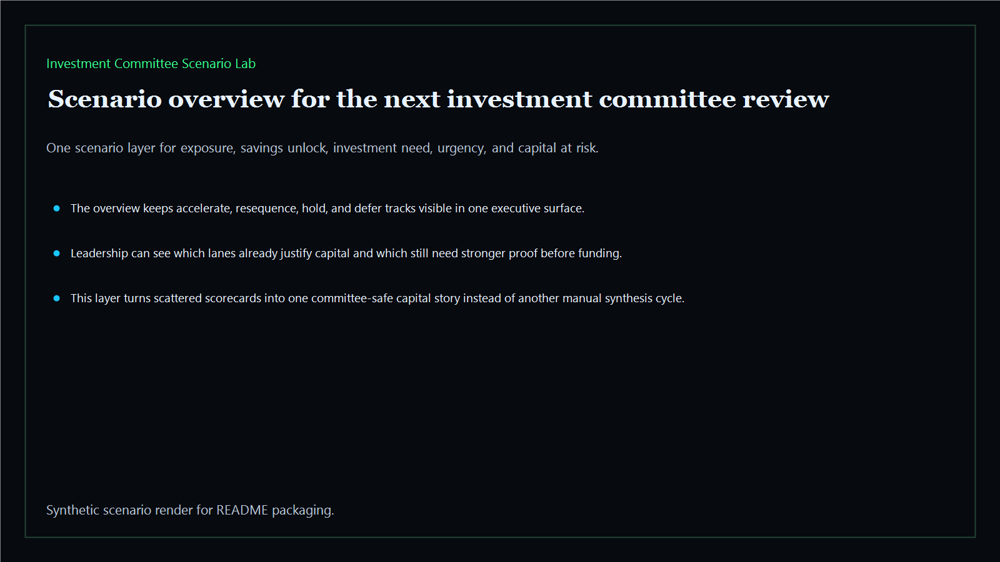
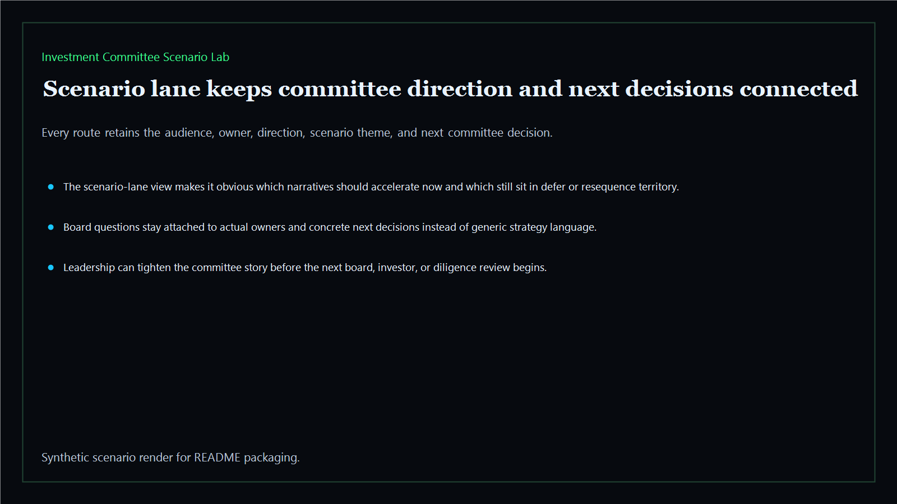
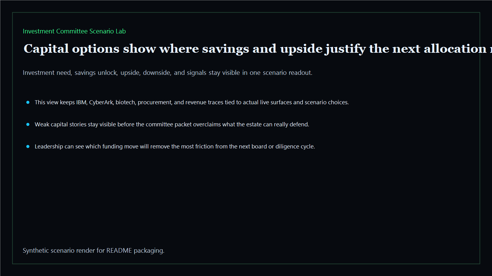
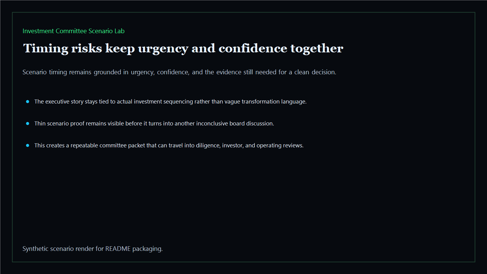

# Investment Committee Scenario Lab

Board-ready scenario layer that compares capital-allocation choices, savings sequencing, and investment timing across the Kinetic Gain estate.

- Live: `https://scenario.kineticgain.com/`
- Repo: `mizcausevic-dev/investment-committee-scenario-lab`

## Why this matters

Leaders need more than isolated scorecards. They need one scenario layer that shows what to accelerate, what to resequence, what to defer, and what capital story survives a board or diligence room.

## What it includes

- TypeScript scenario surface with capital-allocation scoring and board-oriented routes
- synthetic executive lanes across AI, identity, revenue, FinTech, biotech, procurement, and public-sector readiness
- reusable scenario outputs for exposure, savings unlock, investment need, upside, downside, and timing pressure
- prerendered static site, JSON payloads, screenshots, and docs

## Routes

- `/`
- `/scenario-lane`
- `/capital-options`
- `/timing-risks`
- `/verification`
- `/docs`

## Local run

```bash
cd investment-committee-scenario-lab
npm install
npm run verify
npm run prerender
npm run render:assets
```

## CLI

```bash
npx investment-committee-scenario-lab fixtures/investment-committee-scenario-lab.json --format summary
npx investment-committee-scenario-lab fixtures/investment-committee-scenario-lab-clean.json --format json
```

## Docs

- [Architecture](docs/architecture.md)
- [Origin](docs/ORIGIN.md)
- [Kinetic Gain Embedded](docs/KINETIC_GAIN_EMBEDDED.md)

## Screenshots





